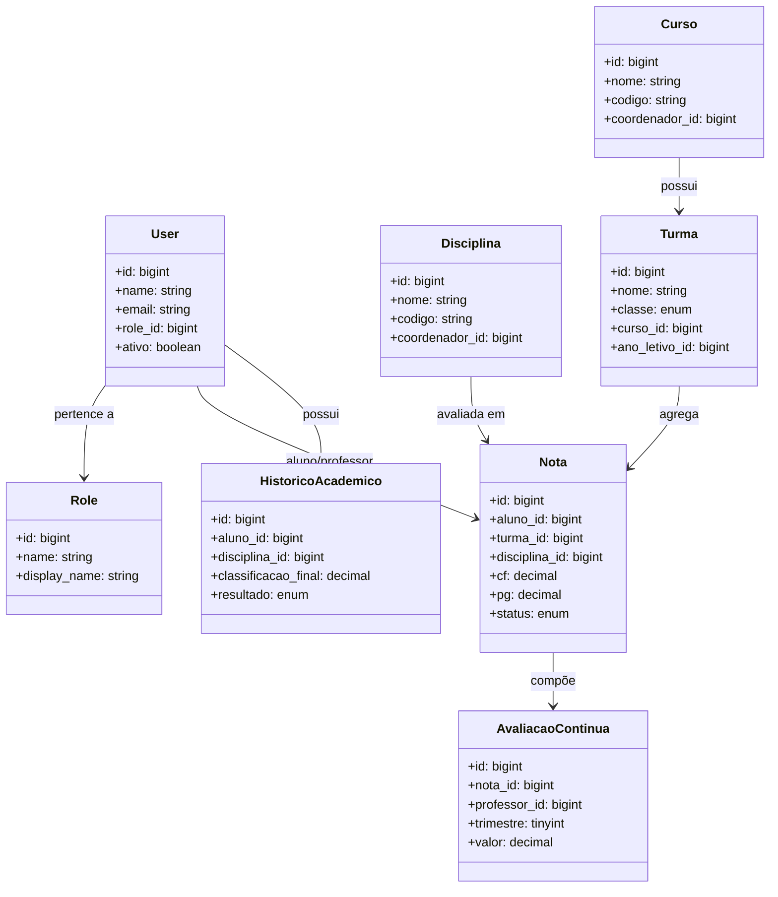
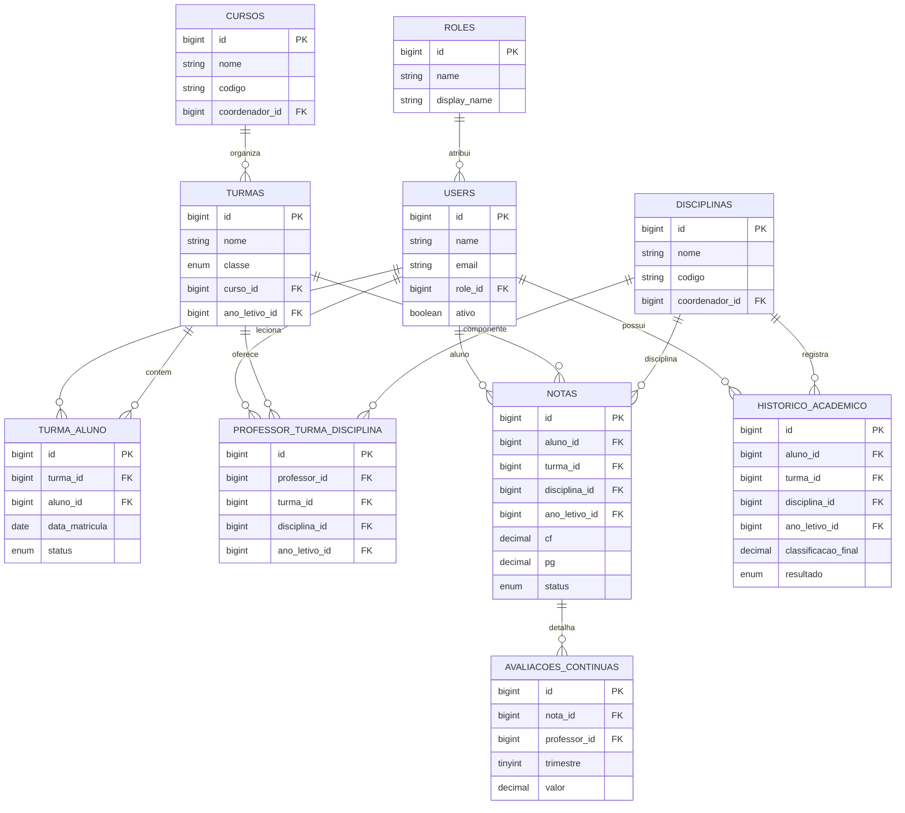

# Diagramas principais do Sistema Escolar

## 1) Diagrama de Caso de Uso
```mermaid
usecaseDiagram
    actor Administrador as Admin
    actor Secretaria as Secretaria
    actor Professor as Professor
    actor Aluno as Aluno
    actor Coordenador as Coordenador

    Admin --> (Gerenciar usuários)
    Admin --> (Gerenciar papéis e permissões)
    Admin --> (Visualizar auditoria e logs)

    Secretaria --> (Gerenciar cursos)
    Secretaria --> (Gerenciar disciplinas)
    Secretaria --> (Gerenciar turmas)
    Secretaria --> (Matricular alunos)
    Secretaria --> (Gerar relatórios)

    Professor --> (Lançar notas)
    Professor --> (Lançar avaliações contínuas)
    Professor --> (Consultar turmas e pautas)
    Professor --> (Gerenciar eventos do calendário)

    Aluno --> (Consultar boletim)
    Aluno --> (Consultar histórico acadêmico)
    Aluno --> (Visualizar calendário)

    Coordenador --> (Acompanhar desempenho da turma)
    Coordenador --> (Aprovar solicitações acadêmicas)
```

## 2) Diagrama de Classes (UML)


## 3) Diagrama Entidade-Relacionamento (DER)

