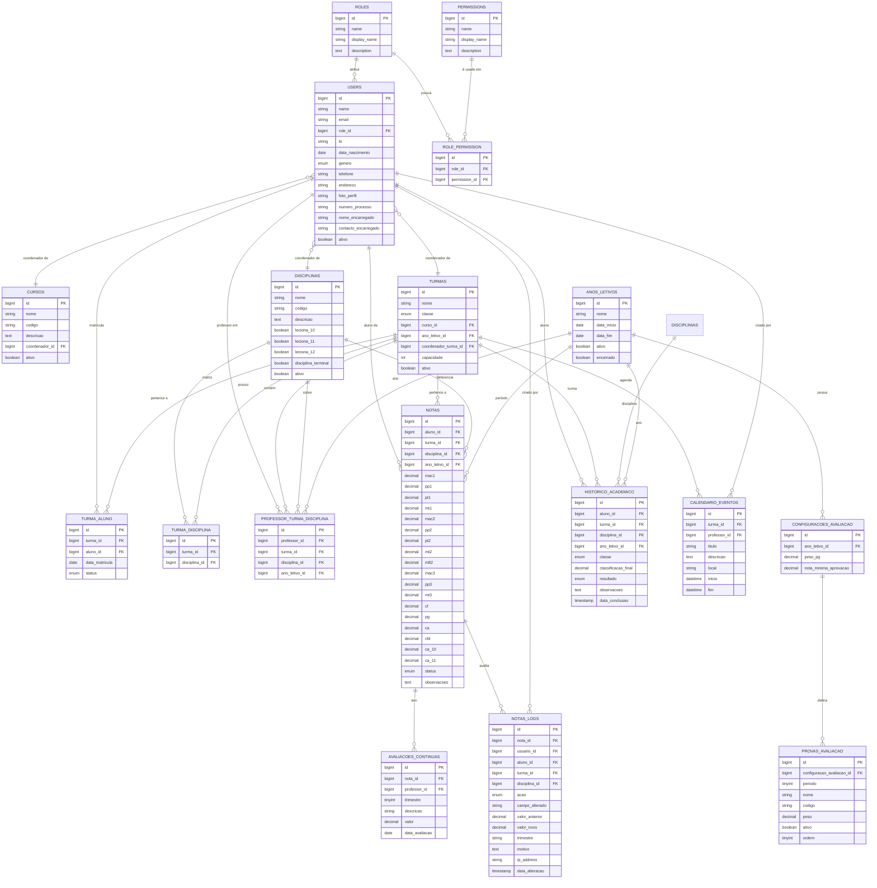
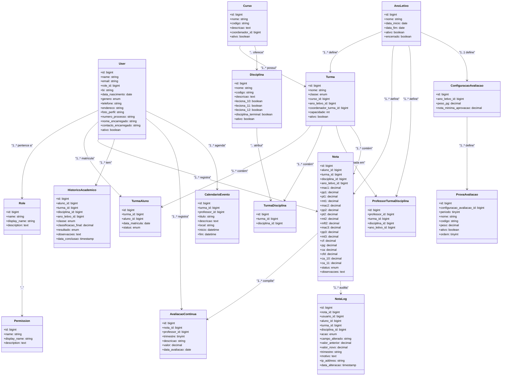
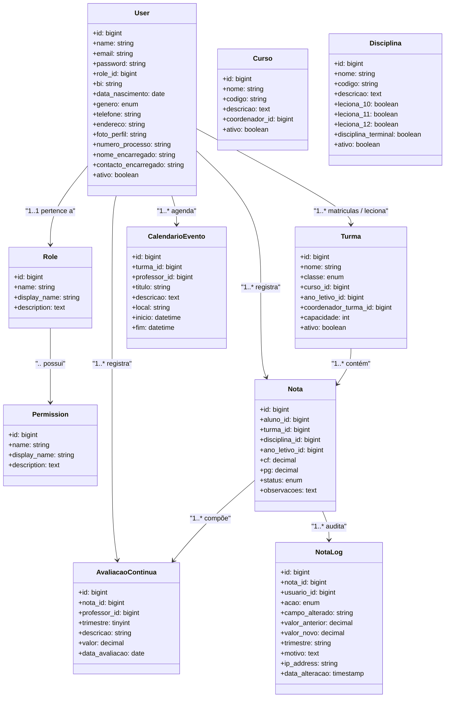

# Diagramas do Sistema Escolar

## 1. Diagrama de Casos de Uso
```mermaid
usecaseDiagram
    actor Administrador as Admin
    actor Secretaria as Secretaria
    actor Professor as Professor
    actor Aluno as Aluno
    actor Coordenador as Coordenador

    Admin --> (Gerenciar usuários)
    Admin --> (Gerenciar papéis e permissões)
    Secretaria --> (Gerenciar usuários)
    Secretaria --> (Gerenciar cursos)
    Secretaria --> (Gerenciar disciplinas)
    Secretaria --> (Gerenciar turmas)
    Secretaria --> (Matricular aluno em turma)
    Secretaria --> (Gerenciar ano letivo)
    Secretaria --> (Gerar relatórios de boletim e histórico)
    Secretaria --> (Gerenciar backups)
    Secretaria --> (Visualizar logs de sistema)

    Professor --> (Consultar notas de turmas)
    Professor --> (Lançar notas e avaliações contínuas)
    Professor --> (Atribuir professor a turma/disciplina)
    Professor --> (Consultar histórico de notas de aluno)
    Professor --> (Gerenciar eventos do calendário)

    Aluno --> (Consultar boletim)
    Aluno --> (Consultar histórico acadêmico)
    Aluno --> (Visualizar calendário escolar)

    Coordenador --> (Consultar desempenho da turma)
    Coordenador --> (Aprovar solicitações de divisão aritmética)
    Coordenador --> (Gerenciar cursos e disciplinas coordenadas)
```

## 2. Diagrama de Fluxo de Dados (DFD) - Nível 1

```mermaid
flowchart TD
    subgraph E1[Usuários Externos]
        A1[Secretaria / Admin]
        A2[Professor]
        A3[Aluno]
    end

    subgraph P[Processos]
        P1[Autenticação e Autorização]
        P2[Gestão de Turmas e Matrículas]
        P3[Gestão de Notas e Avaliações]
        P4[Geração de Relatórios]
        P5[Gestão de Calendário]
        P6[Logs e Auditoria]
        P7[Backup e Recuperação]
    end

    subgraph D[Armazenamento de Dados]
        D1[(users)]
        D2[(roles)]
        D3[(cursos)]
        D4[(disciplinas)]
        D5[(turmas)]
        D6[(turma_aluno)]
        D7[(professor_turma_disciplina)]
        D8[(notas)]
        D9[(avaliacoes_continuas)]
        D10[(configuracoes_avaliacao)]
        D11[(provas_avaliacao)]
        D12[(historico_academico)]
        D13[(notas_logs)]
        D14[(calendario_eventos)]
        D15[(anos_letivos)]
    end

    A1 -->|Autentica/gera relatórios| P1
    A2 -->|Autentica/lança notas| P1
    A3 -->|Autentica/consulta boletim| P1

    P1 --> D1
    P1 --> D2

    A1 -->|Cria/edita turmas e matrículas| P2
    A1 -->|Atribui professores| P2
    A2 -->|Gerencia suas turmas| P2

    P2 --> D3
    P2 --> D4
    P2 --> D5
    P2 --> D6
    P2 --> D7
    P2 --> D15

    A2 -->|Lança notas e avaliações| P3
    A1 -->|Valida notas e finaliza pauta| P3
    A3 -->|Consulta notas| P3

    P3 --> D8
    P3 --> D9
    P3 --> D10
    P3 --> D11
    P3 --> D13

    A1 -->|Solicita relatórios| P4
    A2 -->|Solicita relatórios| P4
    A3 -->|Visualiza boletim| P4

    P4 --> D5
    P4 --> D8
    P4 --> D12
    P4 --> D15

    A2 -->|Gerencia eventos| P5
    A3 -->|Visualiza calendário| P5

    P5 --> D14
    P5 --> D5

    P6 -->|Captura alterações| D13
    P6 -->|Audita usuários| D1

    A1 -->|Executa backup| P7
    P7 --> D1
    P7 --> D5
    P7 --> D8
    P7 --> D14
```


## 3. Diagrama Entidade-Relacionamento (DER)


## 4. Modelo Lógico de Dados


> Observações:
> - O DER identifica `users`, `cursos`, `disciplinas`, `turmas`, `notas`, `anos_letivos` como entidades centrais.
> - O DFD mostra como os atores usam processos-chave e alteram os dados de matrícula, notas, relatórios e calendário.
> - O Modelo Lógico detalha os atributos mais importantes de cada tabela e as principais ligações entre eles.

## 5. Diagrama de Classes (UML)


## 6. Arquitetura Física do Sistema
```mermaid
flowchart LR
    Browser[Usuário (Browser)] -->|HTTPS| WebServer[Nginx / Apache + PHP-FPM]
    WebServer -->|Requisição HTTP| Laravel[Aplicação Laravel]
    Laravel -->|Sessão / Auth| AuthDB[(MySQL / MariaDB)]
    Laravel -->|Consultas e transações| DB[(MySQL / MariaDB)]
    Laravel -->|Armazenamento de ficheiros| Storage[(storage/app/public)]
    Laravel -->|Backup / Export| Backup[(Disco / S3)]
    Laravel -->|Email / notificações| MailService[(SMTP / Mailgun)]
    Laravel -->|Serviços externos| External[(APIs e serviços terceiros)]
```

## 7. Script SQL Modelo Físico de Dados
```sql
CREATE DATABASE IF NOT EXISTS sistema_escolar CHARACTER SET utf8mb4 COLLATE utf8mb4_unicode_ci;
USE sistema_escolar;

CREATE TABLE roles (
    id BIGINT UNSIGNED AUTO_INCREMENT PRIMARY KEY,
    name VARCHAR(100) NOT NULL UNIQUE,
    display_name VARCHAR(150) NOT NULL,
    description TEXT NULL,
    created_at TIMESTAMP NULL,
    updated_at TIMESTAMP NULL
) ENGINE=InnoDB DEFAULT CHARSET=utf8mb4;

CREATE TABLE permissions (
    id BIGINT UNSIGNED AUTO_INCREMENT PRIMARY KEY,
    name VARCHAR(100) NOT NULL UNIQUE,
    display_name VARCHAR(150) NOT NULL,
    description TEXT NULL,
    created_at TIMESTAMP NULL,
    updated_at TIMESTAMP NULL
) ENGINE=InnoDB DEFAULT CHARSET=utf8mb4;

CREATE TABLE role_permission (
    id BIGINT UNSIGNED AUTO_INCREMENT PRIMARY KEY,
    role_id BIGINT UNSIGNED NOT NULL,
    permission_id BIGINT UNSIGNED NOT NULL,
    created_at TIMESTAMP NULL,
    updated_at TIMESTAMP NULL,
    UNIQUE KEY role_permission_unique (role_id, permission_id),
    FOREIGN KEY (role_id) REFERENCES roles(id) ON DELETE CASCADE,
    FOREIGN KEY (permission_id) REFERENCES permissions(id) ON DELETE CASCADE
) ENGINE=InnoDB DEFAULT CHARSET=utf8mb4;

CREATE TABLE users (
    id BIGINT UNSIGNED AUTO_INCREMENT PRIMARY KEY,
    name VARCHAR(255) NOT NULL,
    email VARCHAR(255) NOT NULL UNIQUE,
    email_verified_at TIMESTAMP NULL,
    password VARCHAR(255) NOT NULL,
    role_id BIGINT UNSIGNED NOT NULL,
    bi VARCHAR(50) NULL,
    data_nascimento DATE NULL,
    genero ENUM('M','F','O') NULL,
    telefone VARCHAR(50) NULL,
    endereco VARCHAR(255) NULL,
    foto_perfil VARCHAR(255) NULL,
    numero_processo VARCHAR(100) NULL,
    nome_encarregado VARCHAR(255) NULL,
    contacto_encarregado VARCHAR(100) NULL,
    ativo BOOLEAN NOT NULL DEFAULT TRUE,
    remember_token VARCHAR(100) NULL,
    created_at TIMESTAMP NULL,
    updated_at TIMESTAMP NULL,
    deleted_at TIMESTAMP NULL,
    FOREIGN KEY (role_id) REFERENCES roles(id) ON DELETE RESTRICT
) ENGINE=InnoDB DEFAULT CHARSET=utf8mb4;

CREATE TABLE cursos (
    id BIGINT UNSIGNED AUTO_INCREMENT PRIMARY KEY,
    nome VARCHAR(255) NOT NULL,
    codigo VARCHAR(100) NULL UNIQUE,
    descricao TEXT NULL,
    coordenador_id BIGINT UNSIGNED NULL,
    ativo BOOLEAN NOT NULL DEFAULT TRUE,
    created_at TIMESTAMP NULL,
    updated_at TIMESTAMP NULL,
    FOREIGN KEY (coordenador_id) REFERENCES users(id) ON DELETE SET NULL
) ENGINE=InnoDB DEFAULT CHARSET=utf8mb4;

CREATE TABLE disciplinas (
    id BIGINT UNSIGNED AUTO_INCREMENT PRIMARY KEY,
    nome VARCHAR(255) NOT NULL,
    codigo VARCHAR(100) NULL UNIQUE,
    descricao TEXT NULL,
    leciona_10 BOOLEAN NOT NULL DEFAULT FALSE,
    leciona_11 BOOLEAN NOT NULL DEFAULT FALSE,
    leciona_12 BOOLEAN NOT NULL DEFAULT FALSE,
    disciplina_terminal BOOLEAN NOT NULL DEFAULT FALSE,
    ativo BOOLEAN NOT NULL DEFAULT TRUE,
    created_at TIMESTAMP NULL,
    updated_at TIMESTAMP NULL
) ENGINE=InnoDB DEFAULT CHARSET=utf8mb4;

CREATE TABLE anos_letivos (
    id BIGINT UNSIGNED AUTO_INCREMENT PRIMARY KEY,
    nome VARCHAR(255) NOT NULL,
    data_inicio DATE NOT NULL,
    data_fim DATE NOT NULL,
    ativo BOOLEAN NOT NULL DEFAULT TRUE,
    encerrado BOOLEAN NOT NULL DEFAULT FALSE,
    created_at TIMESTAMP NULL,
    updated_at TIMESTAMP NULL
) ENGINE=InnoDB DEFAULT CHARSET=utf8mb4;

CREATE TABLE turmas (
    id BIGINT UNSIGNED AUTO_INCREMENT PRIMARY KEY,
    nome VARCHAR(255) NOT NULL,
    classe ENUM('10','11','12') NOT NULL,
    curso_id BIGINT UNSIGNED NOT NULL,
    ano_letivo_id BIGINT UNSIGNED NOT NULL,
    coordenador_turma_id BIGINT UNSIGNED NULL,
    capacidade INT NOT NULL DEFAULT 0,
    ativo BOOLEAN NOT NULL DEFAULT TRUE,
    created_at TIMESTAMP NULL,
    updated_at TIMESTAMP NULL,
    FOREIGN KEY (curso_id) REFERENCES cursos(id) ON DELETE CASCADE,
    FOREIGN KEY (ano_letivo_id) REFERENCES anos_letivos(id) ON DELETE RESTRICT,
    FOREIGN KEY (coordenador_turma_id) REFERENCES users(id) ON DELETE SET NULL
) ENGINE=InnoDB DEFAULT CHARSET=utf8mb4;

CREATE TABLE turma_aluno (
    id BIGINT UNSIGNED AUTO_INCREMENT PRIMARY KEY,
    turma_id BIGINT UNSIGNED NOT NULL,
    aluno_id BIGINT UNSIGNED NOT NULL,
    data_matricula DATE NOT NULL,
    status ENUM('matriculado','transferido','desistente','concluido') NOT NULL DEFAULT 'matriculado',
    created_at TIMESTAMP NULL,
    updated_at TIMESTAMP NULL,
    UNIQUE KEY turma_aluno_unique (turma_id, aluno_id),
    FOREIGN KEY (turma_id) REFERENCES turmas(id) ON DELETE CASCADE,
    FOREIGN KEY (aluno_id) REFERENCES users(id) ON DELETE CASCADE
) ENGINE=InnoDB DEFAULT CHARSET=utf8mb4;

CREATE TABLE professor_turma_disciplina (
    id BIGINT UNSIGNED AUTO_INCREMENT PRIMARY KEY,
    professor_id BIGINT UNSIGNED NOT NULL,
    turma_id BIGINT UNSIGNED NOT NULL,
    disciplina_id BIGINT UNSIGNED NOT NULL,
    ano_letivo_id BIGINT UNSIGNED NOT NULL,
    created_at TIMESTAMP NULL,
    updated_at TIMESTAMP NULL,
    FOREIGN KEY (professor_id) REFERENCES users(id) ON DELETE CASCADE,
    FOREIGN KEY (turma_id) REFERENCES turmas(id) ON DELETE CASCADE,
    FOREIGN KEY (disciplina_id) REFERENCES disciplinas(id) ON DELETE CASCADE,
    FOREIGN KEY (ano_letivo_id) REFERENCES anos_letivos(id) ON DELETE RESTRICT
) ENGINE=InnoDB DEFAULT CHARSET=utf8mb4;

CREATE TABLE notas (
    id BIGINT UNSIGNED AUTO_INCREMENT PRIMARY KEY,
    aluno_id BIGINT UNSIGNED NOT NULL,
    turma_id BIGINT UNSIGNED NOT NULL,
    disciplina_id BIGINT UNSIGNED NOT NULL,
    ano_letivo_id BIGINT UNSIGNED NOT NULL,
    mac1 DECIMAL(5,2) NULL,
    pp1 DECIMAL(5,2) NULL,
    pt1 DECIMAL(5,2) NULL,
    mt1 DECIMAL(5,2) NULL,
    mac2 DECIMAL(5,2) NULL,
    pp2 DECIMAL(5,2) NULL,
    pt2 DECIMAL(5,2) NULL,
    mt2 DECIMAL(5,2) NULL,
    mft2 DECIMAL(5,2) NULL,
    mac3 DECIMAL(5,2) NULL,
    pp3 DECIMAL(5,2) NULL,
    mt3 DECIMAL(5,2) NULL,
    cf DECIMAL(5,2) NULL,
    pg DECIMAL(5,2) NULL,
    ca DECIMAL(5,2) NULL,
    cfd DECIMAL(5,2) NULL,
    ca_10 DECIMAL(5,2) NULL,
    ca_11 DECIMAL(5,2) NULL,
    status ENUM('pendente','validado','reprovado','aprovado') NOT NULL DEFAULT 'pendente',
    observacoes TEXT NULL,
    created_at TIMESTAMP NULL,
    updated_at TIMESTAMP NULL,
    FOREIGN KEY (aluno_id) REFERENCES users(id) ON DELETE CASCADE,
    FOREIGN KEY (turma_id) REFERENCES turmas(id) ON DELETE CASCADE,
    FOREIGN KEY (disciplina_id) REFERENCES disciplinas(id) ON DELETE RESTRICT,
    FOREIGN KEY (ano_letivo_id) REFERENCES anos_letivos(id) ON DELETE RESTRICT
) ENGINE=InnoDB DEFAULT CHARSET=utf8mb4;

CREATE TABLE avaliacoes_continuas (
    id BIGINT UNSIGNED AUTO_INCREMENT PRIMARY KEY,
    nota_id BIGINT UNSIGNED NOT NULL,
    professor_id BIGINT UNSIGNED NOT NULL,
    trimestre TINYINT UNSIGNED NOT NULL,
    descricao VARCHAR(255) NOT NULL,
    valor DECIMAL(5,2) NOT NULL,
    data_avaliacao DATE NOT NULL,
    created_at TIMESTAMP NULL,
    updated_at TIMESTAMP NULL,
    FOREIGN KEY (nota_id) REFERENCES notas(id) ON DELETE CASCADE,
    FOREIGN KEY (professor_id) REFERENCES users(id) ON DELETE SET NULL
) ENGINE=InnoDB DEFAULT CHARSET=utf8mb4;

CREATE TABLE configuracoes_avaliacao (
    id BIGINT UNSIGNED AUTO_INCREMENT PRIMARY KEY,
    ano_letivo_id BIGINT UNSIGNED NOT NULL,
    peso_pg DECIMAL(5,2) NOT NULL,
    nota_minima_aprovacao DECIMAL(5,2) NOT NULL,
    created_at TIMESTAMP NULL,
    updated_at TIMESTAMP NULL,
    FOREIGN KEY (ano_letivo_id) REFERENCES anos_letivos(id) ON DELETE CASCADE
) ENGINE=InnoDB DEFAULT CHARSET=utf8mb4;

CREATE TABLE provas_avaliacao (
    id BIGINT UNSIGNED AUTO_INCREMENT PRIMARY KEY,
    configuracao_avaliacao_id BIGINT UNSIGNED NOT NULL,
    periodo TINYINT UNSIGNED NOT NULL,
    nome VARCHAR(150) NOT NULL,
    codigo VARCHAR(100) NULL,
    peso DECIMAL(5,2) NOT NULL,
    ativo BOOLEAN NOT NULL DEFAULT TRUE,
    ordem TINYINT UNSIGNED NOT NULL,
    created_at TIMESTAMP NULL,
    updated_at TIMESTAMP NULL,
    FOREIGN KEY (configuracao_avaliacao_id) REFERENCES configuracoes_avaliacao(id) ON DELETE CASCADE
) ENGINE=InnoDB DEFAULT CHARSET=utf8mb4;

CREATE TABLE historico_academico (
    id BIGINT UNSIGNED AUTO_INCREMENT PRIMARY KEY,
    aluno_id BIGINT UNSIGNED NOT NULL,
    turma_id BIGINT UNSIGNED NOT NULL,
    disciplina_id BIGINT UNSIGNED NOT NULL,
    ano_letivo_id BIGINT UNSIGNED NOT NULL,
    classe ENUM('10','11','12') NOT NULL,
    classificacao_final DECIMAL(5,2) NOT NULL,
    resultado ENUM('aprovado','reprovado','recuperacao','retido') NOT NULL,
    observacoes TEXT NULL,
    data_conclusao TIMESTAMP NULL,
    created_at TIMESTAMP NULL,
    updated_at TIMESTAMP NULL,
    FOREIGN KEY (aluno_id) REFERENCES users(id) ON DELETE CASCADE,
    FOREIGN KEY (turma_id) REFERENCES turmas(id) ON DELETE CASCADE,
    FOREIGN KEY (disciplina_id) REFERENCES disciplinas(id) ON DELETE RESTRICT,
    FOREIGN KEY (ano_letivo_id) REFERENCES anos_letivos(id) ON DELETE RESTRICT
) ENGINE=InnoDB DEFAULT CHARSET=utf8mb4;

CREATE TABLE notas_logs (
    id BIGINT UNSIGNED AUTO_INCREMENT PRIMARY KEY,
    nota_id BIGINT UNSIGNED NOT NULL,
    usuario_id BIGINT UNSIGNED NOT NULL,
    aluno_id BIGINT UNSIGNED NOT NULL,
    turma_id BIGINT UNSIGNED NOT NULL,
    disciplina_id BIGINT UNSIGNED NOT NULL,
    acao ENUM('criado','atualizado','removido') NOT NULL,
    campo_alterado VARCHAR(150) NULL,
    valor_anterior DECIMAL(10,2) NULL,
    valor_novo DECIMAL(10,2) NULL,
    trimestre VARCHAR(20) NULL,
    motivo TEXT NULL,
    ip_address VARCHAR(45) NULL,
    data_alteracao TIMESTAMP NOT NULL DEFAULT CURRENT_TIMESTAMP,
    created_at TIMESTAMP NULL,
    updated_at TIMESTAMP NULL,
    FOREIGN KEY (nota_id) REFERENCES notas(id) ON DELETE CASCADE,
    FOREIGN KEY (usuario_id) REFERENCES users(id) ON DELETE SET NULL,
    FOREIGN KEY (aluno_id) REFERENCES users(id) ON DELETE SET NULL,
    FOREIGN KEY (turma_id) REFERENCES turmas(id) ON DELETE SET NULL,
    FOREIGN KEY (disciplina_id) REFERENCES disciplinas(id) ON DELETE SET NULL
) ENGINE=InnoDB DEFAULT CHARSET=utf8mb4;

CREATE TABLE calendario_eventos (
    id BIGINT UNSIGNED AUTO_INCREMENT PRIMARY KEY,
    turma_id BIGINT UNSIGNED NULL,
    professor_id BIGINT UNSIGNED NULL,
    titulo VARCHAR(255) NOT NULL,
    descricao TEXT NULL,
    local VARCHAR(255) NULL,
    inicio DATETIME NOT NULL,
    fim DATETIME NOT NULL,
    created_at TIMESTAMP NULL,
    updated_at TIMESTAMP NULL,
    FOREIGN KEY (turma_id) REFERENCES turmas(id) ON DELETE SET NULL,
    FOREIGN KEY (professor_id) REFERENCES users(id) ON DELETE SET NULL
) ENGINE=InnoDB DEFAULT CHARSET=utf8mb4;
```

## 8. Script SQL de Criação das Tabelas Principais
```sql
-- Tabelas centrais do sistema
CREATE TABLE roles (
    id BIGINT UNSIGNED AUTO_INCREMENT PRIMARY KEY,
    name VARCHAR(100) NOT NULL UNIQUE,
    display_name VARCHAR(150) NOT NULL,
    description TEXT NULL
) ENGINE=InnoDB DEFAULT CHARSET=utf8mb4;

CREATE TABLE users (
    id BIGINT UNSIGNED AUTO_INCREMENT PRIMARY KEY,
    name VARCHAR(255) NOT NULL,
    email VARCHAR(255) NOT NULL UNIQUE,
    password VARCHAR(255) NOT NULL,
    role_id BIGINT UNSIGNED NOT NULL,
    ativo BOOLEAN NOT NULL DEFAULT TRUE,
    created_at TIMESTAMP NULL,
    updated_at TIMESTAMP NULL,
    FOREIGN KEY (role_id) REFERENCES roles(id) ON DELETE RESTRICT
) ENGINE=InnoDB DEFAULT CHARSET=utf8mb4;

CREATE TABLE cursos (
    id BIGINT UNSIGNED AUTO_INCREMENT PRIMARY KEY,
    nome VARCHAR(255) NOT NULL,
    codigo VARCHAR(100) NULL UNIQUE,
    coordenador_id BIGINT UNSIGNED NULL,
    ativo BOOLEAN NOT NULL DEFAULT TRUE,
    FOREIGN KEY (coordenador_id) REFERENCES users(id) ON DELETE SET NULL
) ENGINE=InnoDB DEFAULT CHARSET=utf8mb4;

CREATE TABLE turmas (
    id BIGINT UNSIGNED AUTO_INCREMENT PRIMARY KEY,
    nome VARCHAR(255) NOT NULL,
    classe ENUM('10','11','12') NOT NULL,
    curso_id BIGINT UNSIGNED NOT NULL,
    ano_letivo_id BIGINT UNSIGNED NOT NULL,
    ativo BOOLEAN NOT NULL DEFAULT TRUE,
    FOREIGN KEY (curso_id) REFERENCES cursos(id) ON DELETE CASCADE,
    FOREIGN KEY (ano_letivo_id) REFERENCES anos_letivos(id) ON DELETE RESTRICT
) ENGINE=InnoDB DEFAULT CHARSET=utf8mb4;

CREATE TABLE notas (
    id BIGINT UNSIGNED AUTO_INCREMENT PRIMARY KEY,
    aluno_id BIGINT UNSIGNED NOT NULL,
    turma_id BIGINT UNSIGNED NOT NULL,
    disciplina_id BIGINT UNSIGNED NOT NULL,
    ano_letivo_id BIGINT UNSIGNED NOT NULL,
    status ENUM('pendente','validado','reprovado','aprovado') NOT NULL DEFAULT 'pendente',
    observacoes TEXT NULL,
    FOREIGN KEY (aluno_id) REFERENCES users(id) ON DELETE CASCADE,
    FOREIGN KEY (turma_id) REFERENCES turmas(id) ON DELETE CASCADE
) ENGINE=InnoDB DEFAULT CHARSET=utf8mb4;
```

## 9. Autenticação e Controlo de Acesso
O sistema usa o `guard` padrão `web` do Laravel para autenticação de sessão. A autenticação é tratada pelo middleware `Authenticate`, enquanto o controlo de acesso por papel e permissões é feito com RBAC usando `Role`, `Permission`, `CheckRole` e `CheckPermission`.

### 9.1 Configuração do guard web
```php
// config/auth.php
'defaults' => [
    'guard' => env('AUTH_GUARD', 'web'),
    'passwords' => env('AUTH_PASSWORD_BROKER', 'users'),
],

'guards' => [
    'web' => [
        'driver' => 'session',
        'provider' => 'users',
    ],
],

'providers' => [
    'users' => [
        'driver' => 'eloquent',
        'model' => App\Models\User::class,
    ],
],
```

### 9.2 Middleware de autenticação e RBAC
```php
// app/Http/Middleware/Authenticate.php
namespace App\Http\Middleware;

use Illuminate\Auth\Middleware\Authenticate as Middleware;
use Illuminate\Http\Request;

class Authenticate extends Middleware
{
    protected function redirectTo(Request $request): ?string
    {
        return $request->expectsJson() ? null : route('login');
    }
}
```

```php
// app/Http/Middleware/CheckRole.php
namespace App\Http\Middleware;

use Closure;
use Illuminate\Http\Request;
use Symfony\Component\HttpFoundation\Response;

class CheckRole
{
    public function handle(Request $request, Closure $next, string ...$roles): Response
    {
        if (!auth()->check()) {
            return redirect()->route('login');
        }

        $user = auth()->user();
        $roleName = $user->role->name;

        if (!in_array($roleName, $roles)) {
            abort(403, 'Acesso não autorizado.');
        }

        return $next($request);
    }
}
```

```php
// app/Http/Middleware/CheckPermission.php
namespace App\Http\Middleware;

use Closure;
use Illuminate\Http\Request;
use Symfony\Component\HttpFoundation\Response;

class CheckPermission
{
    public function handle(Request $request, Closure $next, string $permission): Response
    {
        if (!auth()->check()) {
            return redirect()->route('login');
        }

        if (!$request->user()?->hasPermission($permission)) {
            abort(403, 'Você não tem permissão para acessar esta página.');
        }

        return $next($request);
    }
}
```

### 9.3 RBAC no modelo
```php
// app/Models/User.php
public function role()
{
    return $this->belongsTo(Role::class);
}

public function hasPermission(string $permissionName): bool
{
    $this->loadMissing('role.permissions');
    return $this->role?->hasPermission($permissionName) ?? false;
}
```

```php
// app/Models/Role.php
public function permissions()
{
    return $this->belongsToMany(Permission::class, 'role_permission')->withTimestamps();
}

public function hasPermission(string $permissionName): bool
{
    return $this->getPermissionNames()->contains($permissionName);
}
```

### 9.4 Exemplo de uso em rotas
```php
Route::middleware(['auth', 'role:admin,secretaria'])->group(function () {
    Route::resource('users', UserController::class);
});

Route::middleware(['auth', 'permission:notas.lancar'])->post('notas/lancar', [NotaController::class, 'store']);
```
